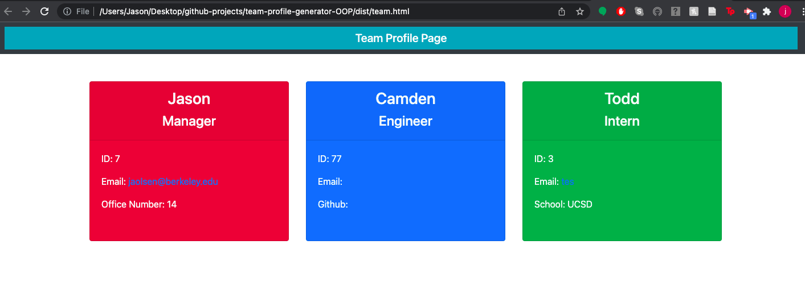

# team-profile-generator-OOP

## Description

This project was very challenging but also very rewarding. It involves using Node.JS/Object-Oriented Programming in order to create an app that generates a team profile with individual team cards with the input data. 

## Installation

You can git clone my project. In order to run index.js, open an Integrated terminal in the src folder. My code works according to this folder, don't think this is conventional oops.

## Usage

## Credits

I had a little help from my tutor, Omar Carmona, but most guidance was by my professor, John.

## Tests

I wrote tests, as this was the original part of the assignment, however, I could not figure out how to get them to run.